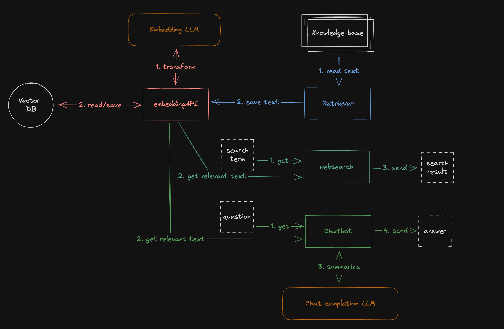

# RAG Workshop

This project is the boilerplate for the **"Build your own AI-powered internal search engine"** workshop for **TechSauce Global Summit 2024** on 8th August 2024.

This workshop's audience is developers who have never worked with AI/LLM before. The goal is to introduce the concept of how LLM works, RAG (Retrieval-Augmented Generation), Embeddings. And build a simple search engine and a chatbot using these concepts.

**[See slide deck here](https://github.com/user-attachments/files/16560825/byoai-v2.pdf)**

## Project Structure

> The `main` branch has incomplete code. The workshop divided into 3 stages. Each stage has its own branch. `main` branch has the starting code for the workshop. Then, `pre-workshop-2` branch has the completed code from stage 1, and so on. The final code is in the `final` branch.

There are 4 main components in this project:

- **Embedding API** - A simple REST API to save text and retrieve text relevant to the input query. Hiding the complexity of embeddings and vector manipulation.
- **Search UI** - A simple search engine UI to search for text using the Embedding API.
- **Chatbot UI** - A simple chatbot UI to chat with information retrieved via the Embedding API.
- **Retriever** - A simple script to scan knowledge base and save the text to the Embedding API.

Each component is its own service and communicates with each other via REST API. The system diagram is as follows:

The folder structure is as follows:

- `common` - Contains the common code used by multiple components. (config, LLM, models)
- `embedding-api`, `search_web`, `chatbot`, `retriever` - Contains the code for each component. The `server.py` file is the entry point of each.
- `docs` - Contains the images and other files used in the README.
- `demo` - Contains sample data or prompts.

This workshop primaliry uses OpenAI services, so you need to have an OpenAI account and API key to run this project. But feel free to update the code (`common/llm.py`) to use any other provider.

## [Then, checkout wiki for workshop handbook](https://github.com/encX/rag-workshop/wiki)
Again, to skip the workshop, you can directly go to the `final` branch to see the final code.
